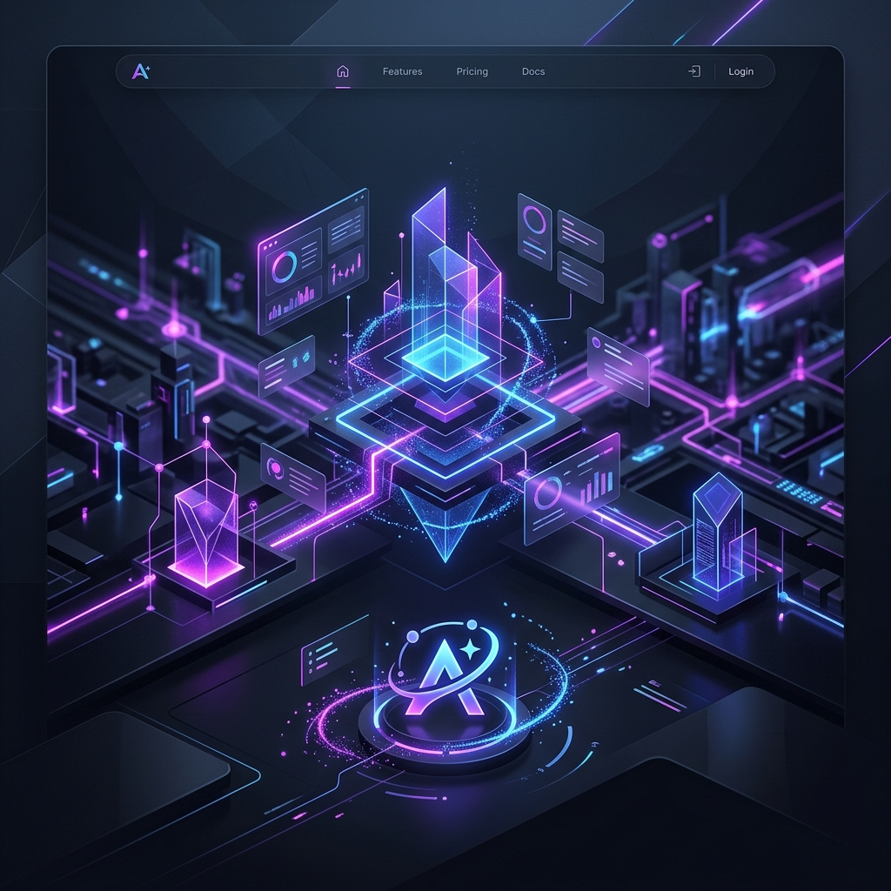

  
  
   
   

  # 🚀 Aetros - Zero-Error SaaS Boilerplate
  
  **Die ultimative Grundlage für dein nächstes SaaS-Imperium.**
  

---

## 🌟 Was ist Aetros?

**Aetros** ist eine extrem robuste und vollständig konfigurierte **Next.js Boilerplate**. Sie nimmt dir tagelange Arbeit ab, indem sie die komplexe Architektur für Authentifizierung, Zahlungsabwicklung und Datenbank-Management out-of-the-box mitbringt. 

Wenn du ein Software-as-a-Service (SaaS) Produkt aufbauen möchtest, liefert dir Aetros das perfekte, fehlerfreie Fundament. Alles ist typisiert, abgesichert und im modernen Dark-Mode designt.

### 🛠️ Eingebaute Features:
- 🔐 **Authentifizierung & Datenbank:** Fertiges Setup mit Supabase (PostgreSQL).
- 💳 **Monetarisierung:** Komplette Stripe-Integration inkl. Webhooks & Kundenportal.
- 🎨 **Premium UI:** Wunderschönes Design dank TailwindCSS und Shadcn/ui.
- ⚙️ **Nutzer-Dashboard:** Ein fertiges Dashboard, wo Nutzer direkt ihre Profil-Einstellungen anpassen können.

---

## 💻 Tech Stack

- ⚡ **Next.js** (App Router, TypeScript)
- 🎨 **TailwindCSS** + **Shadcn/ui**
- 🗄️ **Supabase** (Auth, PostgreSQL, Row-Level-Security)
- 💰 **Stripe** (Checkout Sessions, Subscriptions, Webhooks)

---

## 🚦 Schnellstart (Getting Started)

Dank der mitgelieferten Skripte ist die Installation ein Kinderspiel:

1. **Repository klonen**
2. **Setup ausführen:** Führe einfach einen Doppelklick auf die `setup.bat` aus. Das Skript installiert alle NPM-Abhängigkeiten in einem wunderschönen Regenbogen-Terminal.
3. **API Keys eintragen:** Öffne die generierte `.env.local` Datei und füge deine Supabase & Stripe Keys ein.
4. **Server starten:** Führe einen Doppelklick auf `launch.bat` aus. Das Skript sucht automatisch einen freien Port und startet den Server.

---

## 🤖 Antigravity Quick-Customization

Diese Boilerplate wurde so entworfen, dass sie mithilfe des KI-Assistenten **Antigravity** blitzschnell erweitert werden kann. Nutze einfach einen der folgenden Prompts in deiner Antigravity IDE, um magische Änderungen vorzunehmen:

### 1. ✨ "Füge ein neues Feature hinzu..."
> *"Füge eine neue geschützte Seite unter `/dashboard/analytics` hinzu. Integriere ein Shadcn-Chart zur Visualisierung von Dummy-Daten und achte auf Error-Handling."*

### 2. 💸 "Ändere das Stripe-Preismodell..."
> *"Ersetze das aktuelle Pricing-Modell durch zwei neue Pläne: 'Hobby' für 9$/Monat und 'Pro' für 29$/Monat. Aktualisiere die Pricing-Table in `app/page.tsx` und erstelle neue Stripe-Preis-IDs."*

### 3. 🖌️ "Passe das Design an..."
> *"Ändere das primäre Farbschema von den aktuellen Dark-Mode-Tönen zu einem lebendigen 'Neon-Cyberpunk' Stil. Aktualisiere die `globals.css` Variablen für `--primary` und `--background`."*

---

## 📜 License

Dieses Projekt ist lizenziert unter der **MIT License**. Copyright (c) 2026 Maximilian Holzer.
